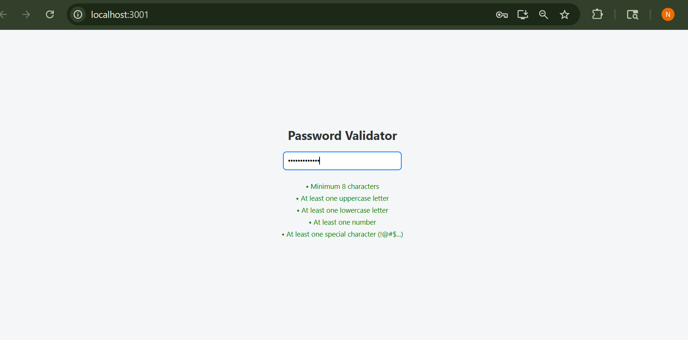

# Password Validator

A simple React application to validate how strong your password is based on certain rules like:
- Minimum length of 8 characters
- At least one uppercase letter
- At least one lowercase letter
- At least one number
- At least one special character

---

## Features

- Real-time password validation

## Screenshot

---

## Built With

- React

